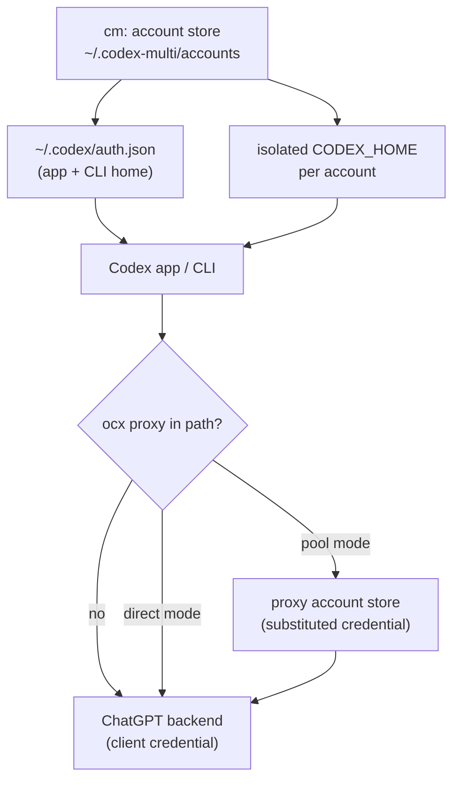

# How the hybrid account paths fit together

`cm` and the opencodex proxy (`ocx`) touch ChatGPT credentials at different
points. The normal workflow uses one desktop app with the OCX account pool;
`cm app` remains an exception for a separate login, SQLite database, and browser
profile. Neither tool owns or rewrites the other's credential store.

## Who owns the credential

`cm` owns the credential store. It keeps one file per account under
`~/.codex-multi/accounts` and decides which one is installed as
`~/.codex/auth.json` (the app and CLI home), plus per-account isolated
`CODEX_HOME` directories under `~/.codex-multi/homes`.

`ocx` does not read `cm`'s store. It has two possible behaviours for Codex
traffic, selected by its OpenAI provider's `codexAccountMode`:

| Mode | Which credential reaches ChatGPT | Effect on per-account isolation |
|------|----------------------------------|---------------------------------|
| `direct` | The bearer token the calling client already sent | The account selected by `cm` or the native app is billed |
| `pool` | A token OCX selects from its own account store | New tasks use the OCX-selected account; running tasks keep their starting account |

In `direct` mode the proxy requires the caller to present a bearer token and
then forwards it untouched. It reads no credential file at all for that request.
In `pool` mode it maintains its own accounts and can also rotate in the "main"
account by reading `~/.codex/auth.json` directly — which is the file `cm`
manages, but read-only and without `cm`'s knowledge of which account that is.

## Operating policy

**Normal path: one app, OCX pool.** Select the account with
`ocx account current openai` and `ocx account use openai <id>`. The selection
applies to new tasks; a running task keeps the account it started with. No app
restart or `cm switch` is required.

**Exception path: isolated app.** `cm app <account>` launches a separate
`CODEX_HOME`, app profile, login, and account-local `state_5.sqlite`. When OCX is
in `pool` mode, its selected account still determines the upstream account for
each new task; the isolated app login and the OCX billing account are distinct
identities. Use `direct` mode only when the isolated app login itself must be the
upstream account.

**Task history is shared, indexes are not.** Isolated homes link both `sessions`
and `archived_sessions` to the default app home so active and archived rollouts
remain portable across app profiles. Each home retains a private SQLite index.
Before an isolated app starts, `cm` reconciles both active and archived task
lists on an inactive database copy, integrity-checks it, keeps a bounded backup,
and atomically replaces the old index. It never shares one live SQLite database
between app-server writers.

**The credential stores stay separate.** OCX refreshes its pool credentials;
`cm` keeps isolated-app credentials. The normal runtime never mirrors token
refreshes between the two stores. The auth portal is a narrow, event-driven
exception: a new owner-approved login version may be applied once to both the
configured cm account and one explicitly bound OCX slot. The local checkpoint
prevents periodic re-copying of the same grant. `cm doctor` reports pool size
and mode without treating OCX accounts as `cm`-owned data.

**Neither tool requires the other.** `cm` still manages native/direct accounts
without OCX, and OCX still manages its pool without `cm`.

## A caveat about the proxy's own config file

A running proxy can rewrite its config file from in-memory state. If you edit
that file by hand, stop the service first, edit, then start it again — otherwise
your change is overwritten. `cm` only ever reads that file.

## Why `cm` does not continuously copy refreshed tokens into the proxy

Copying credentials into the proxy's separate store (`codex-accounts.json`)
would create two refresh owners for one grant:

- Pool entries are OCX-owned and ignored in `direct` mode.
- In `pool` mode, account selection belongs to OCX and should use OCX's native
  login, reauthentication, and removal commands.
- The proxy refreshes pool credentials on its own schedule. ChatGPT's OAuth
  refresh returns a new refresh token, so two stores holding the same grant will
  eventually invalidate each other's copy and force a re-login.

One credential file, one refresher. The stores can coexist, but their tokens
must not be synchronized continuously.

The operational auth portal has one narrow exception for owner-approved login
events. The server retains only the newest validated OAuth envelope. The Mac
compares its applied job id, updates the matching cm account, then hands that
same version to one explicitly selected OCX slot through OCX's loopback native
API. Existing-slot replacement is identity checked and preserves the stable
slot id, active selection, alias, plan, and pause state. The operation holds a
writer lock, keeps bounded snapshots, warms and verifies the account, and rolls
back a partial replacement. The OCX manual-import gate exists only in the
one-shot process and is never persisted in launchd. Between owner login events,
OCX remains the refresh owner for its pool copy; AICC does not mirror OCX's
rotating refresh token back into cm or the server.
