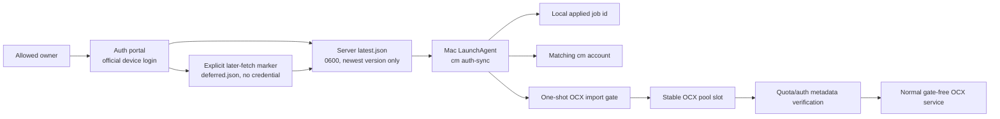

# Auth portal to OCX synchronization

This workflow handles one explicit account. It is for an owner who can complete
an official OpenAI device login in the web portal while the destination Mac is
offline or unable to complete OAuth locally.

## Data flow



The broker validates the physical ChatGPT account id against
`CM_AUTH_EXPECTED_ACCOUNT_ID_SHA256` before storing anything. It retains one
latest OAuth envelope in `CM_AUTH_STATE_DIR/latest.json`; a later owner login
atomically replaces that file. A Mac acknowledgement writes `last-ack.json` but
does not delete the latest credential.

The human portal administrator and the retained Codex account are separate
identities. `CM_AUTH_ALLOWED_EMAIL` allowlists the Google account that may
operate the portal, while `CM_AUTH_EXPECTED_ACCOUNT_ID_SHA256` pins the Codex
account that may be stored. Changing the portal administrator must never change
the expected Codex account hash, the local `CM_AUTH_TARGET_ACCOUNT`, or the
stable OCX target slot.

After a successful login, the existing portal page shows **나중에 Mac으로
가져오기**. Pressing it records an idempotent, secret-free `deferred.json`
marker for the retained job. The marker confirms the owner's intent without
moving or duplicating the OAuth envelope and without changing the Mac API.
Consequently, the Mac may be powered off when the login is completed and the
button is pressed. The retained latest login remains available until a newer
successful login atomically replaces it.

The Mac stores only the last applied job id in
`~/.ai-control-center/account-manager/auth-portal-sync.json`. A poll for that
same id returns no work, so the LaunchAgent does not restart OCX every fifteen
minutes. Deleting the local checkpoint intentionally replays the retained
latest credential; the cm and OCX import paths are idempotent.

If the stable OCX slot already contains the exact retained access/refresh token
pair, the poller only performs the native account refresh check, acknowledges
the job, and leaves the running service untouched.

## Required local configuration

Copy `ops/auth-portal/local.env.example` to the configured private state path
and set:

```dotenv
CM_AUTH_TARGET_ACCOUNT=owner@example.com
CM_AUTH_OCX_TARGET_ACCOUNT=chatgpt-stable-pool-id
CM_AUTH_PORTAL_URL=https://private-auth.example.com
CM_AUTH_KEYCHAIN_SERVICE=com.aicc.account-manager.auth-portal
CM_AUTH_OCX_BASE_URL=http://127.0.0.1:10100
CM_AUTH_SYNC_OPENCODEX=1
```

The real file must be mode `0600`. The portal bearer belongs in macOS Keychain,
not this file. `CM_AUTH_OCX_TARGET_ACCOUNT` is an exact OCX native slot id from
`ocx account list openai --json`. For an existing owner, bind that existing id;
inventing a new id creates a duplicate slot rather than refreshing it.

## Update transaction

For a new portal job, the poller performs these steps:

1. Validate that the incoming full account id matches the configured cm account.
2. Save the latest auth through cm's normal private credential writer.
3. Snapshot `~/.opencodex/config.json` and `codex-accounts.json` under the
   private, bounded `~/.opencodex/cm-auth-backups` directory.
4. Read OCX's scalar active-turn counter through its authenticated loopback
   management API. If a response is in flight, leave OCX untouched and retry on
   the next LaunchAgent interval.
5. Stop only OCX, then start a temporary loopback process with the manual import
   gate enabled in that process environment.
6. If the target slot exists, compare its full email and ChatGPT account id,
   remove it through the native API, and recreate the same stable id with the
   new credential. Preserve plan, alias, paused state, and prior active slot.
7. Force-refresh safe account metadata and reject `needsReauth`.
8. Stop the gated process and start the normal gate-free OCX service.
9. Acknowledge the server job and atomically advance the local checkpoint.

If any step after the snapshot fails, the importer first attempts a native API
rollback. After the gated process has stopped, the outer transaction restores
the pre-import OCX snapshot and restarts the normal service. Tokens and request
bodies are never printed.

## Operations

Manual run:

```bash
cm auth-sync
```

Read-only checks:

```bash
cm status --json
ocx account list openai --json
ocx account current openai
curl --fail --silent https://private-auth.example.com/health
```

The macOS LaunchAgent template is
`ops/auth-portal/deploy/com.codex-account-manager.auth-sync.plist`. It runs at
login and every 900 seconds. Install it only after the local configuration,
Keychain bearer, target cm account, and exact OCX slot id have all been
verified. Loading it can immediately run one sync.

When the Mac is off, complete the official login and press **나중에 Mac으로
가져오기** on the same portal. On the next macOS login the LaunchAgent runs
immediately; while that user session remains active it checks again every 900
seconds. This is a login-session agent, so powering on the Mac without logging
in does not run it.

## Security and ownership

- The public page is only a UI shell. Firebase verification and the allowed
  owner email are enforced by the broker.
- `/api/mac/*` uses a separate bearer and must remain excluded from browser
  Access redirects. The broker itself remains loopback-only behind the tunnel.
- The retained OAuth, local cm auth, OCX credential store, checkpoints, and
  backups are runtime secrets and must never enter Git, logs, screenshots, or
  support bundles.
- `deferred.json` stores only a job identifier and request timestamp. It never
  contains the OAuth envelope, account id, email, or bearer.
- OCX management calls read its existing `admin-api-token` private file at
  request time. The synchronizer does not copy that secret into AICC config.
- This is event-driven synchronization of a newly approved login version. It is
  not periodic copying of OCX's rotating refresh token. After import, OCX owns
  refresh of its pool copy until the owner completes another portal login.
